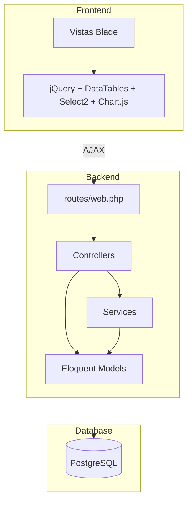
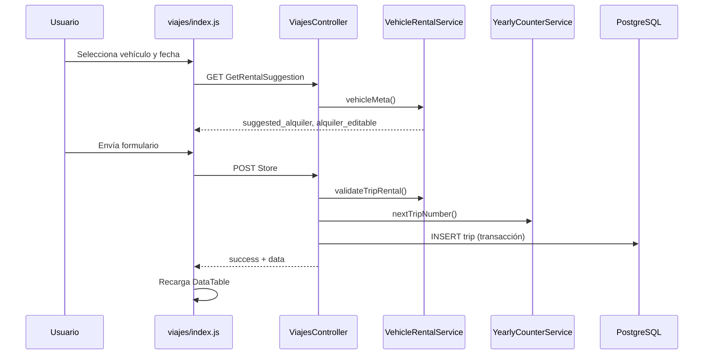
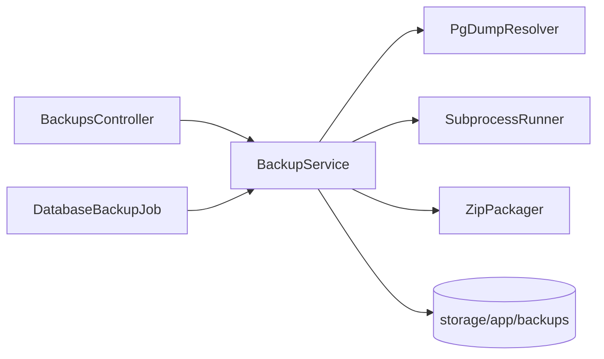

# Arquitectura — Modelos, base de datos y middleware

## Diagrama general

## Roles y permisos

| Rol | Acceso |
|-----|--------|
| `user` (conductor) | Dashboard, viajes, gastos, vehículos, gráficos, maestros, perfil, exportaciones. Solo ve **sus** datos. |
| `admin` | Todo lo anterior + administración (usuarios, respaldos, descifrado emergencia). |

**RBAC (v1.0+):** permisos granulares por opción de menú (`app_options` → `role_permissions`). Middleware `permission:{slug}` en rutas. Ver [SEGURIDAD.md](SEGURIDAD.md).

El middleware legacy `EnsureAdmin` (`admin`) sigue disponible; las rutas nuevas usan `permission`.

---

## Modelos Eloquent

### User

Tabla: `users`

| Campo | Tipo | Descripción |
|-------|------|-------------|
| `name` | string | Nombre completo |
| `email` | string | Correo único |
| `password` | hashed | Contraseña |
| `dui` | string | Documento único (El Salvador) |
| `is_active` | boolean | Si puede iniciar sesión |
| `role` | string | `admin` o `user` |
| `theme_preference` | string | `light`, `dark`, `auto` |

Relaciones: `vehicles`, `sessions`, `yearlyCounters`, `monthlySummaries`.

Método: `isAdmin(): bool`.

### Vehicle

Tabla: `vehicles`

| Campo | Descripción |
|-------|-------------|
| `user_id` | Propietario del registro |
| `ownership_type_id` | FK a `vehicle_ownership_types` |
| `plate_number` | Placa (máx. 15 chars) |
| `rental_fee_daily` | Cuota de alquiler (según periodo) |
| `rental_period` | `daily`, `weekly`, `monthly` |
| `is_active` | Visible en selectores de viajes/gastos |

Relación: `ownershipType` → `VehicleOwnershipType`.

### Trip

Tabla: `trips` (particionada por rango de `fecha`)

| Campo | Descripción |
|-------|-------------|
| `uuid` | Identificador único |
| `user_id`, `anio`, `trip_number` | Clave compuesta + numeración |
| `vehicle_id` | Vehículo usado |
| `fecha`, `dia_semana` | Fecha y nombre del día (es) |
| `indrive`, `otros_viajes`, `propina`, `alquiler` | Columnas legacy (0 cuando `encryption_version = 1`) |
| `encrypted_payload` | JSON cifrado con montos reales (v1.0+) |
| `encryption_version` | `0` = legacy en claro, `1` = cifrado envelope |

Montos visibles vía `FinancialRecordService::decryptTripRow()`. Campos de cifrado deben estar en `$fillable` del modelo.

### Expense

Tabla: `expenses` (particionada por rango de `fecha`)

| Campo | Descripción |
|-------|-------------|
| `uuid` | Identificador único |
| `user_id`, `anio`, `expense_number` | Clave compuesta + numeración |
| `category_id` | FK a `expense_categories` |
| `vehicle_id` | Opcional, vehículo relacionado |
| `fecha`, `monto`, `descripcion` | Columnas legacy (vacías/0 con cifrado activo) |
| `encrypted_payload`, `encryption_version` | Cifrado envelope (igual que viajes) |

### Otros modelos

| Modelo | Tabla | Uso |
|--------|-------|-----|
| `VehicleOwnershipType` | `vehicle_ownership_types` | Maestro: ALQUILADO, PROPIO, etc. |
| `ExpenseCategory` | `expense_categories` | Maestro: GASOLINA, MANTENIMIENTO, etc. |
| `UserSession` | `user_sessions` | Auditoría de login/logout e IP |
| `YearlyCounter` | `yearly_counters` | Contadores anuales por usuario |
| `MonthlySummary` | `monthly_summaries` | Resúmenes precalculados (estructura preparada) |

---

## Base de datos

**Motor:** PostgreSQL (requerido por particionamiento y operador `ilike`).

### Particionamiento

Las tablas `trips` y `expenses` usan `PARTITION BY RANGE (fecha)`. La migración inicial crea una partición por año calendario (ej. `trips_2026`).

> **Importante:** Al cambiar de año, hay que crear manualmente la partición del nuevo año antes de insertar registros.

### Índices

- `idx_trips_search` → `(user_id, fecha, vehicle_id)`
- `idx_expenses_search` → `(user_id, fecha, vehicle_id)`

### Seeders

| Seeder | Datos iniciales |
|--------|-----------------|
| `VehicleOwnershipTypeSeeder` | ALQUILADO, PROPIO, FINANCIADO, OTRO |
| `ExpenseCategorySeeder` | GASOLINA, ALQUILER, COMIDA, MANTENIMIENTO, OTROS |
| `UserSeeder` | Usuario conductor y administrador de prueba |
| `DemoDataSeeder` | Datos de demostración (viajes, gastos, vehículos) |

Ejecutar: `php artisan db:seed`

---

## Flujo de registro de un viaje

---

## Seguridad

- **Autenticación:** Sesiones Laravel con CSRF en todas las peticiones POST/PUT/DELETE.
- **Autorización por datos:** Los controladores filtran por `Auth::id()` — un conductor nunca ve datos de otro.
- **Admin:** Rutas de usuarios protegidas con middleware `admin`.
- **Validación:** Laravel Request validation en cada endpoint de escritura.
- **Contraseñas:** Hash bcrypt, mínimo 8 caracteres.

---

## Exportaciones

`ExportController` usa **DomPDF** (`barryvdh/laravel-dompdf`) para PDF y streaming CSV con BOM UTF-8.

Plantilla PDF compartida: `resources/views/exports/viajes-pdf.blade.php`.

---

## Respaldos de base de datos (v1.2.1+)

| Componente | Rol |
|------------|-----|
| `BackupService` | Dump SQL, empaquetado ZIP, retención, tokens |
| `PgDumpResolver` | Resuelve binario `pg_dump` según SO |
| `SubprocessRunner` | `proc_open` con entorno mínimo (Windows) |
| `ZipPackager` | ZIP vía `ZipArchive`, PowerShell o `zip` |
| `PlatformPath` | Normaliza rutas con `\` y `/` |
| `BackupDownloadToken` | Enlace de descarga de un solo uso |

Archivos generados: `storage/app/backups/YYYY/MM/conductorledger_YYYYMMDD_HHMMSS.zip` (contiene un `.sql` plain de PostgreSQL).

---

## Tema visual

- CSS personalizado: `public/css/app-themes.css`
- Atributo `data-theme="light|dark"` en `<html>`
- Preferencia persistida en BD (`users.theme_preference`) y localStorage como respaldo
- Script inline en layout evita flash de tema incorrecto al cargar
