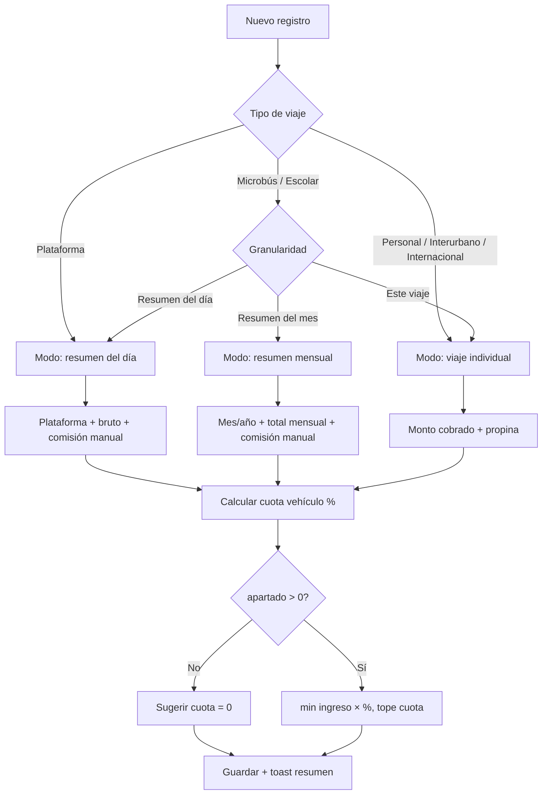

# Plan de implementación — Registro diario de viajes v2

**Versión del plan:** 1.1 (decisiones confirmadas)  
**Fecha:** 2026-07-12  
**Estado:** Implementado (v1.2.0)

---

## 0. Decisiones confirmadas

| Tema | Decisión |
|------|----------|
| **Microbús** | Modo variable: viaje individual, resumen del día **o** resumen del mes (toggle en formulario) |
| **Plataformas iniciales** | InDrive, Uber, DiDi, Cabify, Otro — más pantalla de mantenimiento para agregar/editar |
| **Comisión** | Monto ingresado manualmente por el usuario (sin cálculo automático) |
| **Datos existentes** | `migrate:fresh --seed` (sin script de migración de datos) |

---

## 1. Resumen ejecutivo

El conductor que hace muchos viajes al día no puede anotar viaje por viaje. Este plan migra el módulo de **viajes** a un modelo **híbrido** con tres granularidades de registro:

| Granularidad | Cuándo | Qué se registra |
|--------------|--------|-----------------|
| **Resumen diario** | Plataformas (Uber, InDrive…) | Total del día: bruto, comisión (manual), propinas |
| **Resumen mensual** | Microbús con cobro mensual fijo | Total del mes en una fecha de cierre |
| **Viaje individual** | Aparte, microbús por viaje, interurbano, internacional | Monto cobrado en **ese** viaje |

Además: DUI opcional, cuota vehículo con % configurable, filtros fecha/plataforma, permisos admin, maestros, fixes móvil (logout, loader).

> Todos los cambios de esquema van en **migraciones existentes** — sin archivos de migración nuevos.

---

## 2. Problemas actuales → soluciones

| # | Problema | Solución |
|---|----------|----------|
| 1 | Registro viaje a viaje tedioso | Resumen diario/mensual + viaje individual |
| 2 | Sin comisión de app | Campo `comision_app` — ingreso manual del usuario |
| 3 | Cuota vehículo = 100% diario | `% del viaje` + `monto apartado`; sugerencia = `min(ingreso × %, cuota diaria)` |
| 4 | Salir no visible en móvil | Scroll en sidebar + botón Salir en header móvil |
| 5 | Loader trabado | `ajaxError` + reset de seguridad 30s |
| 6 | DUI obligatorio | `nullable` en DB y formularios |
| 7 | Sin filtros | Desde/hasta, plataforma, tipo viaje, vehículo |
| 8 | Gastos sin reflejar filtros | Mismos filtros + totales en cabecera |
| 9 | Sin UI permisos | Pantallas Roles y Permisos |
| 10 | Maestros incompletos | Plataformas, Tipos de viaje |

---

## 3. Modelo de datos

### 3.1 Tabla `trip_types` — `2026_01_01_000001`

| Campo | Tipo | Descripción |
|-------|------|-------------|
| `id` | SERIAL PK | |
| `code` | VARCHAR(30) UNIQUE | |
| `name` | VARCHAR(80) | |
| `allowed_modes` | VARCHAR(50) | JSON o flags: qué modos admite el tipo |
| `is_active` | BOOLEAN | |

**Modos de registro (`registration_mode` en cada trip):**

| Valor | Significado |
|-------|-------------|
| `per_trip` | Un viaje / un cobro |
| `daily` | Resumen de un día |
| `monthly` | Resumen de un mes (microbús, escolar mensual) |

**Seed inicial:**

| code | name | Modos permitidos |
|------|------|------------------|
| `PLATAFORMA` | Plataforma | `daily` |
| `PERSONAL` | Viaje aparte | `per_trip` |
| `MICROBUS_RUTA` | Microbús / ruta | `per_trip`, `daily`, `monthly` |
| `ESCOLAR` | Transporte escolar | `daily`, `monthly` |
| `INTERURBANO` | Interurbano | `per_trip` |
| `INTERNACIONAL` | Internacional | `per_trip` |

### 3.2 Tabla `platforms` — `2026_01_01_000001`

| Campo | Tipo | Descripción |
|-------|------|-------------|
| `id` | SERIAL PK | |
| `name` | VARCHAR(50) UNIQUE | |
| `is_active` | BOOLEAN | |

**Seed:** InDrive, Uber, DiDi, Cabify, Otro.

**Pantalla de mantenimiento** (`/Maestros/Plataformas`): CRUD para agregar plataformas futuras sin tocar código.

> Sin `default_commission_pct` — la comisión la ingresa el usuario manualmente.

### 3.3 Tabla `trips` — columnas nuevas

```sql
trip_type_id       INT  REFERENCES trip_types(id) NOT NULL,
platform_id        INT  REFERENCES platforms(id) NULL,
registration_mode  VARCHAR(10) NOT NULL DEFAULT 'per_trip',  -- per_trip | daily | monthly
period_year        INT  NULL,   -- para monthly: año del período
period_month       INT  NULL,   -- para monthly: mes del período (1-12)
monto_bruto        DECIMAL(10,2) DEFAULT 0,
comision_app       DECIMAL(10,2) DEFAULT 0,   -- ingreso manual
monto_cobrado      DECIMAL(10,2) DEFAULT 0,
porcentaje_cuota   DECIMAL(5,2) DEFAULT 0,
propina            DECIMAL(10,2) DEFAULT 0,   -- se mantiene
alquiler           DECIMAL(10,2) DEFAULT 0,   -- se mantiene
```

**Columnas legacy** (`indrive`, `otros_viajes`): se mantienen en tabla, siempre 0 en claro; datos reales en `encrypted_payload` v2.

**Unicidad por modo:**

| Modo | Clave única |
|------|-------------|
| `daily` + PLATAFORMA | `(user_id, fecha, vehicle_id, platform_id)` |
| `daily` + otro tipo | `(user_id, fecha, vehicle_id, trip_type_id)` |
| `monthly` | `(user_id, period_year, period_month, vehicle_id, trip_type_id)` |
| `per_trip` | Sin restricción (múltiples por día) |

### 3.4 Tabla `vehicles` — `2026_07_04_000002`

| Campo | Tipo | Default | Descripción |
|-------|------|---------|-------------|
| `quota_percentage` | DECIMAL(5,2) | 0 | % del ingreso a apartar para cuota |
| `quota_reserve_amount` | DECIMAL(10,2) | 0 | Si es 0 → sugerencia de cuota = 0 |

### 3.5 Tabla `users` — `0001_01_01_000000`

```php
$table->string('dui', 10)->nullable()->unique();
```

---

## 4. Lógica de negocio

### 4.1 Ingresos según modo

```
PLATAFORMA / resumen diario o mensual:
  ingresos = monto_bruto - comision_app + propina

Viaje individual (per_trip):
  ingresos = monto_cobrado + propina

neto = ingresos - alquiler
```

### 4.2 Comisión

- Campo numérico libre; el usuario escribe el monto que la app le descontó.
- Sin cálculo automático ni sugerencia por %.
- Validación: `comision_app >= 0` y `comision_app <= monto_bruto` (si bruto > 0).

### 4.3 Cuota del vehículo

```
base_ingreso = (registration_mode in [daily, monthly])
    ? monto_bruto - comision_app
    : monto_cobrado

si quota_reserve_amount == 0  →  sugerencia = 0
si quota_percentage == 0      →  sugerencia = 0
sino:
  sugerencia = min(
    base_ingreso × (quota_percentage / 100),
    cuota_diaria_prorrateada
  )
```

**Ejemplo:** Viaje $10, cuota mensual $200, 15% apartado → sugerencia **$1.50** (no $200).

Para resumen **mensual** microbús: la base es el total del mes; el tope de cuota es la cuota mensual completa del vehículo.

### 4.4 Microbús — flujo variable

En el formulario, al elegir tipo `MICROBUS_RUTA` o `ESCOLAR`:

```
¿Cómo quieres registrar?
  ○ Este viaje / cobro puntual     → per_trip
  ○ Resumen del día                → daily
  ○ Resumen del mes                → monthly
```

- **per_trip:** fecha + monto cobrado
- **daily:** fecha + monto bruto del día (comisión opcional si aplica)
- **monthly:** selector mes/año + monto total del mes; `fecha` = último día del mes o fecha de cierre elegida

### 4.5 Cifrado

`encrypted_payload` v2 incluye todos los campos financieros nuevos. Columnas en claro = 0.

---

## 5. UI/UX

### 5.1 Formulario de viajes

```
Paso 1: Tipo de viaje
  ├─ Plataforma ──────────────► modo daily fijo
  ├─ Personal / Interurbano / Internacional ─► modo per_trip fijo
  └─ Microbús / Escolar ──────► toggle: viaje | día | mes

Paso 2: Campos según modo
  Plataforma (daily):
    - Plataforma, fecha, monto bruto, comisión (manual), propina
  Mensual:
    - Mes/año, monto bruto total, comisión (manual), propina
  Individual:
    - Fecha, monto cobrado, propina

Paso 3 (todos):
  - % cuota vehículo (pre-llenado desde vehículo)
  - Alquiler sugerido (calculado, editable)

Toast al guardar:
  "Ganaste $X | Comisión: $Y | Cuota vehículo: $Z | Neto: $W"
```

### 5.2 Filtros — Viajes y Gastos

| Filtro | Viajes | Gastos |
|--------|:------:|:------:|
| Desde / Hasta | ✓ | ✓ |
| Plataforma | ✓ | — |
| Tipo de viaje | ✓ | — |
| Modo (día/mes/viaje) | ✓ | — |
| Categoría | — | ✓ |
| Vehículo | ✓ | ✓ |

Cabecera con totales del rango: ingresos, comisiones, alquiler, gastos, neto.

### 5.3 Vehículos

- `% del viaje para cuota` (0–100)
- `Monto apartado` — si 0, sugerencia cuota = 0
- Texto de ayuda sobre financiamiento

### 5.4 Móvil

- `.cl-nav { overflow-y: auto; min-height: 0; }`
- `.cl-sidebar-footer { flex-shrink: 0; }`
- `#btnLogoutMobile` en header móvil
- `logout.js` unifica `#btnLogout, #btnLogoutMobile`

### 5.5 Loader

- Handler `ajaxError` con mismo decremento que `ajaxComplete`
- Reset forzado si `_ajaxLoaderCount > 0` tras 30 segundos

### 5.6 DUI

- Campo visible pero opcional en registro, perfil y usuarios
- Backend: `nullable`; si vacío → `null`

---

## 6. Pantallas nuevas

| Pantalla | Ruta | Permiso slug |
|----------|------|--------------|
| Plataformas | `/Maestros/Plataformas` | `plataformas` |
| Tipos de viaje | `/Maestros/TiposViaje` | `tipos-viaje` |
| Roles | `/Admin/Roles` | `admin.roles` |
| Permisos por rol | `/Admin/Permisos` | `admin.permisos` |

Cada maestro: DataTable + crear/editar; baja lógica (`is_active = false`).

Sidebar dinámico desde `app_options` + `PermissionService`.

---

## 7. Fases de implementación

### Fase 1 — Esquema y modelos (3–4 h)

**Migraciones (editar existentes):**
- `0001_01_01_000000_create_users_table.php` → DUI nullable
- `2026_01_01_000001_create_conductor_ledger_schema.php` → `trip_types`, `platforms`, columnas `trips`
- `2026_07_04_000002_add_role_and_rental_period.php` → `quota_percentage`, `quota_reserve_amount`

**Nuevos seeders:**
- `TripTypeSeeder.php`
- `PlatformSeeder.php`

**Modelos y servicios:**
- `TripType.php`, `Platform.php`
- Actualizar `Trip.php`, `Vehicle.php`, `User.php`
- `FinancialRecordService.php` — payload v2
- `VehicleRentalService.php` — algoritmo % cuota

**Comando:**
```bash
php artisan migrate:fresh --seed
```

---

### Fase 2 — Backend core (4–5 h)

| Archivo | Cambios |
|---------|---------|
| `ViajesController.php` | store con modos, validación unicidad, filtros DataTable, totales |
| `GastosController.php` | filtros fecha/categoría/vehículo, totales |
| `PlataformasController.php` | CRUD maestro *(nuevo)* |
| `TiposViajeController.php` | CRUD maestro *(nuevo)* |
| `PermisosController.php` | gestión roles/permisos *(nuevo)* |
| `routes/web.php` | rutas nuevas + middleware permisos |
| `api_endpoints.js` | endpoints nuevos |
| `AppOptionSeeder.php` | slugs plataformas, tipos-viaje, admin.roles, admin.permisos |
| `RolePermissionSeeder.php` | permisos conductor/admin |

---

### Fase 3 — Frontend viajes, gastos, móvil (5–6 h)

| Archivo | Cambios |
|---------|---------|
| `viajes/index.blade.php` | formulario multi-modo, barra filtros, totales |
| `viajes/index.js` | lógica toggle día/mes/viaje, comisión manual, sugerencia cuota |
| `gastos/index.blade.php` + `index.js` | filtros + totales |
| `vehiculos/index.blade.php` + `index.js` | % cuota, monto apartado |
| `layouts/app.blade.php` | menú dinámico, logout móvil |
| `app-themes.css` | sidebar scroll, header logout |
| `loader.js` | ajaxError + reset |
| `logout.js` | btnLogoutMobile |

**Vistas maestros nuevas:**
- `maestros/plataformas/`
- `maestros/tipos-viaje/`
- `admin/permisos/`

---

### Fase 4 — DUI opcional (1 h)

- `RegistrationController`, `PerfilController`, `UsuariosController` → `nullable`
- Vistas: quitar `required`, placeholder "Opcional"

---

### Fase 5 — Dashboard, gráficos, export (2–3 h)

- `DashboardController` — agregaciones por plataforma dinámica
- `GraficosController` — desglose por plataforma desde `platforms`
- `ExportController` — columnas nuevas + filtros
- `DemoDataSeeder` — datos de ejemplo con nuevo modelo

---

### Fase 6 — Documentación y release (2–3 h)

- Actualizar `docs/API.md`, `ARQUITECTURA.md`, `RUTAS.md`, `JAVASCRIPT.md`
- `docs/VERSIONAMIENTO.md` → **v1.2.0**
- Este plan → estado "Implementado"
- Push a `main`

---

## 8. Diagrama de flujo



---

## 9. Plan de pruebas

| # | Caso | Entrada | Esperado |
|---|------|---------|----------|
| 1 | Resumen InDrive | bruto $50, comisión $12 (manual) | Neto = $38 + propina − alquiler |
| 2 | Viaje personal | cobrado $15 | Row individual; no bloquea plataforma mismo día |
| 3 | Duplicado diario | 2× InDrive mismo día | Error validación |
| 4 | Microbús mensual | mes 07/2026, total $800 | Un row mensual; unicidad por mes |
| 5 | Microbús por viaje | 3 viajes mismo día | 3 rows permitidos |
| 6 | Cuota % | viaje $10, 15%, apartado > 0 | Sugerencia $1.50 |
| 7 | Sin apartado | apartado = 0 | Sugerencia = 0 |
| 8 | Tope cuota | ingreso $100, 50%, cuota diaria $6.67 | Sugerencia = $6.67 |
| 9 | Comisión manual | usuario escribe $8.50 | Se guarda exactamente $8.50 |
| 10 | Filtro fechas | 01/07–15/07 | Solo rows en rango |
| 11 | Filtro plataforma | Uber | Solo Uber |
| 12 | DUI null | registro sin DUI | `dui = null` OK |
| 13 | Logout móvil | 375px viewport | Salir visible sin abrir menú |
| 14 | Loader error | POST 500 | Overlay se oculta |
| 15 | Maestro plataforma | agregar "Bolt" | Aparece en select viajes |
| 16 | Gastos filtrados | rango + categoría GASOLINA | Lista y totales OK |

```bash
php artisan migrate:fresh --seed
php artisan test
```

---

## 10. Estimación total

| Fase | Horas |
|------|-------|
| 1 — Esquema | 3–4 |
| 2 — Backend | 4–5 |
| 3 — Frontend | 5–6 |
| 4 — DUI | 1 |
| 5 — Dashboard/export | 2–3 |
| 6 — Permisos + docs + push | 4–5 |
| **Total** | **~20–24 h** |

---

## 11. Entregables

1. Código implementado (fases 1–6)
2. `migrate:fresh --seed` verificado
3. Pruebas manuales según tabla §9
4. Documentación actualizada (`API`, `ARQUITECTURA`, `RUTAS`, `JAVASCRIPT`, `VERSIONAMIENTO`)
5. Versión **v1.2.0**
6. Push a rama **`main`**

---

## 12. Orden de ejecución recomendado

```
Fase 1 → migrate:fresh --seed
    ↓
Fase 2 + 4 (backend + DUI, en paralelo)
    ↓
Fase 3 (frontend)
    ↓
Fase 5 (dashboard/export)
    ↓
Fase 6 (permisos admin + maestros + docs)
    ↓
Pruebas §9 → push main
```

---

*Plan v1.1 — Decisiones confirmadas. Responde **"autorizado"** para iniciar la implementación.*
